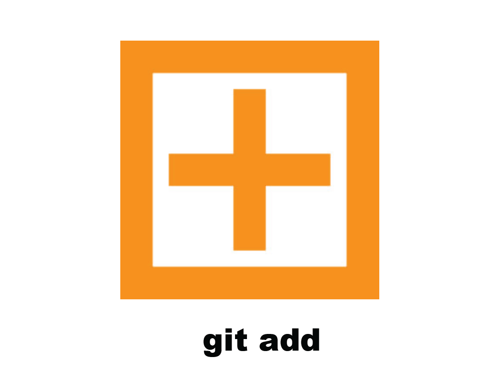
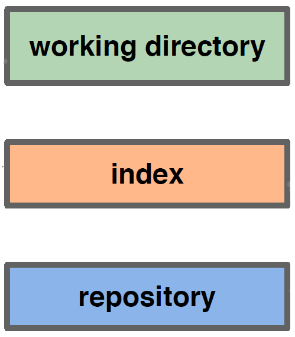
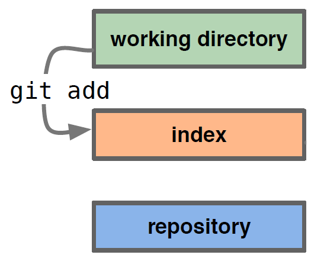

!SLIDE center
# A Basic Workflow #

## Edit files ##
## Stage the changes ##
## Review your changes ##
## Commit the changes ##

!SLIDE center

!SLIDE center

!SLIDE center

!SLIDE

<pre>
$ git add main.rb
$ git status
# On branch master
# Changes to be committed:
#   (use "git reset HEAD <file>..." to unstage)
#
#	modified:   main.rb
#
</pre>

!SLIDE

<pre>
$ git add main.rb
$ git status
# On branch master
# Changes THAT ARE STAGED:
#   (use "git reset HEAD <file>..." to unstage)
#
#	modified:   main.rb
#
</pre>
	
!SLIDE commandline incremental small

	$ vim app.yaml
	
!SLIDE

	application: meridth
	version: 1
	runtime: ruby
	api_version: 1
	handlers:
	- url: .*
	script: main.rb
	~
	~
	~
	"app.yaml" 8L, 101C
	
!SLIDE

	application: meridth
	version: 
	runtime: ruby
	api_version: 1
	handlers:
	- url: .*
	script: main.rb
	~
	~
	~
	"app.yaml" 8L, 101C
	
!SLIDE

	application: meridth
	version: 2
	runtime: ruby
	api_version: 1
	handlers:
	- url: .*
	script: main.rb
	~
	~
	~
	"app.yaml" 8L, 101C

!SLIDE small

<pre>
$ git status
# On branch master
# Changes to be committed:
# (use "git reset HEAD <file>..." to unstage)
#
# modified: main.rb
#
# Changed but not updated:
# (use "git add <file>..." to update what will be committed)
#
# modified: app.yaml
#
</pre>

!SLIDE commandline incremental small

	$ vim main.rb
	
!SLIDE code
	
	@@@ruby
	#! /usr/bin/env ruby
	
	# this program prints out 'hello world'

	puts 'hello world'
	
!SLIDE
## we change the comment to use 'Hola Mundo' instead of 'Hello World'##

!SLIDE code
	
	@@@ruby
	#! /usr/bin/env ruby
	
	# this program prints out 'Hola Mundo'

	puts 'Hola Mundo'
	
!SLIDE small

<pre>
$ git status
# On branch master
# Changes to be committed:
# (use "git reset HEAD <file>..." to unstage)
#
# modified: main.rb
#
# Changed but not updated:
# (use "git add <file>..." to update what will be committed)
#
# modified: app.yaml
# modified: main.rb
#
</pre>

!SLIDE small

<pre>
$ git status
# On branch master
# Changes THAT ARE STAGED:
# (use "git reset HEAD <file>..." to unstage)
#
# modified: main.rb
#
# Changed but not updated:
# (use "git add <file>..." to update what will be committed)
#
# modified: app.yaml
# modified: main.rb
#
</pre>

!SLIDE small

<pre>
$ git status
# On branch master
# Changes to be committed:
# (use "git reset HEAD <file>..." to unstage)
#
# modified: main.rb
#
# Changed THAT ARE UNSTAGED:
# (use "git add <file>..." to update what will be committed)
#
# modified: app.yaml
# modified: main.rb
#
</pre>

!SLIDE small

<pre>
$ git status
# On branch master
# Changes to be committed:
# (use "git reset HEAD <file>..." to unstage)
#
# modified: main.rb
#
# Changed but not updated:
# (use "git add <file>..." to update what will be committed)
#
# modified: app.yaml
# modified: main.rb
#
</pre>

!SLIDE center

!SLIDE center

!SLIDE center
# You have to stage a file 
# after you edit it

!SLIDE center
# You have to stage a file 
# **after** you edit it

!SLIDE center
# You have to stage a file 
# after you edit it

!SLIDE small

<pre>
$ git add app.yaml main.rb
$ git status
# On branch master
# Changes to be committed:
# (use "git reset HEAD <file>..." to unstage)
#
# modified: app.yaml
# modified: main.rb
#
</pre>
